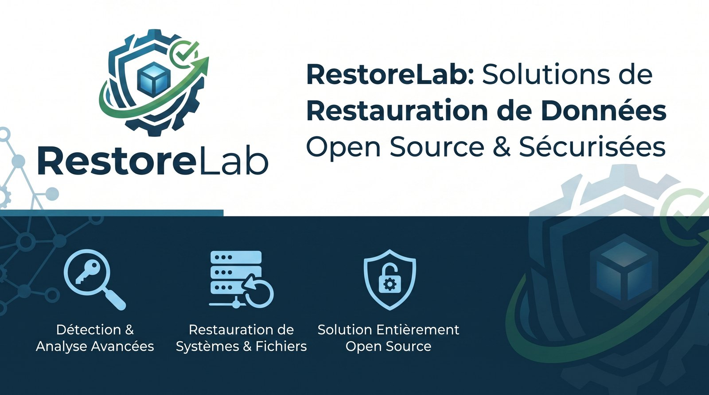

<p align="center">
  
</p>

<p align="center">
  <strong>Your backups are green. But can you actually recover?</strong>
</p>

<p align="center">
  <a href="LICENSE"></a>
  
  
</p>

---

RestoreLab automatically restores your backups into isolated environments, boots
the workloads, validates the services, measures your real recovery time, and
cleans everything up.

```text
Backup verification says:          RestoreLab says:

  ✓ Backup exists                    ✓ VM restored
  ✓ Checksum valid                   ✓ OS booted
                                     ✓ PostgreSQL started
                                     ✓ API returned HTTP 200
                                     ✓ Recovery completed in 2m06
```

A backup that restores is not the same thing as a service that comes back. The
VM boots but PostgreSQL does not start. The database starts but the schema is
inconsistent. The API answers but Redis was never restored. Recovery takes 45
minutes against a 15-minute RTO. **RestoreLab tests the whole chain, on a
schedule, and proves it.**

## What it does

```text
Backup exists → available → restore succeeds → guest boots → OS reachable
    → services start → application responds → dependencies usable → RTO measured
```

Every recovery drill runs against a **temporary workload on an isolated
network**, never against production, and every temporary resource RestoreLab
creates is stamped with ownership metadata so cleanup can never touch anything
it did not create.

## Status

Alpha, under active development. The Proxmox recovery drill pipeline works
end to end behind the CLI and has been proven against a real cluster, drill
history is kept automatically, recovery plans live in the database, and the
HTTP API both serves that history and triggers new drills through a worker
that drains a queue.

**The web interface is the priority, and its first half is here.** Proving a
backup can recover a service is worth doing by an operations team, not only by
whoever is comfortable in a terminal — so the goal is one binary, one command,
and a browser that sets itself up and runs everything from there. The command
line keeps every capability; it is what automation drives.

The dashboard runs the tool today. It shows what is running, what has run,
what is protected and whether the cluster is configured correctly, with a
drill's phases filling in live while it happens - and it starts drills,
cancels them, destroys what they leave behind, and writes the plan catalogue
with the binary itself validating each document as you type. First-run setup
happens in the browser too: one command, then a link.

**A plan no longer has to be launched by hand.** A plan carrying a `schedule`
queues its own drills, on its own, and a slot that comes due while the server
was off is skipped rather than caught up hours later — see
[docs/scheduling.md](docs/scheduling.md).

**A drill now says what it actually proved.** A green verdict and a proven
recovery are not the same claim: a drill whose only check prints the guest's
hostname establishes that the kernel booted and can fork a process, and
nothing about the service or the data. So every run records a proof level —
`NONE`, `BOOT`, `SERVICE` or `DATA` — the reports print it beside the verdict,
and it is a **ceiling** on the confidence score rather than a footnote: 60 for
a drill that only verified the boot, 85 for one that verified the service, 100
only where a check declared `proves: data`. A dashboard of reassuring green
that proves nothing is the most dangerous way for a tool like this to fail.
See [docs/recovery-plans.md](docs/recovery-plans.md#proves).

Two things in the list below are implemented and unit-tested but have never
run against real infrastructure, because the cluster this was built on has
neither: **Proxmox Backup Server**, and the **network checks**, which need a
route to the isolated bridge (see
[docs/network-isolation.md](docs/network-isolation.md)). Everything else has
been driven against a live Proxmox VE 9 cluster.

| Area | State |
| --- | --- |
| Proxmox VE provider (restore / harden / start / status / delete) | done |
| Proxmox Backup Server discovery | done, never run against a real PBS |
| Recovery engine (isolation, capacity, cleanup, RTO, grading) | done |
| Checks: ping, tcp, http/https, dns | done, never run against a real isolated bridge |
| In-guest checks through the QEMU guest agent (no network path needed) | done |
| CLI (`init`, `provider`, `workloads`, `backups`, `recovery`, `cleanup`) | done |
| Reports: terminal, JSON, self-contained HTML | done |
| One-command setup (`connect`) creating a least-privilege service account | done |
| `doctor` diagnostics and `network create` for the isolated bridge | done |
| Drill history, SQLite by default, PostgreSQL optional (`runs`, `db`) | done |
| HTTP API + token auth and scopes (`serve`, `token`) | done |
| Recovery confidence score, computed from the stored history | done |
| Proof level: what each drill established, and the ceiling it puts on the score | done |
| Triggering and cancelling drills over HTTP, worker, queue, live event stream | done |
| Recovery plans stored in the database, edited over HTTP or with `plan` | done |
| Browser session cookie, so a dashboard can authenticate and read the event stream | done |
| Web dashboard, served from the binary: overview, history, live drill, workloads, diagnostics | done |
| Launching and cancelling drills from the browser, and destroying what they leave behind | done |
| Writing the plan catalogue in the browser, validated by the binary as you type | done |
| First-run setup in the browser, replacing the install commands | done |
| Scheduled drills: a plan's cron queues its own drills, unattended | done |
| SSH / PostgreSQL / MySQL checks, notifications | next |
| Remote probes, RBAC, OIDC | planned |

## Quick start

```bash
docker run -p 8080:8080 -v restorelab:/home/restorelab/.restorelab   ghcr.io/restorelab/restorelab serve --listen 0.0.0.0:8080
```

Or a binary, from the [latest release](https://github.com/restorelab/restorelab/releases/latest)
— one file, no runtime, `SHA256SUMS` beside it:

```bash
curl -fsSL -O https://github.com/restorelab/restorelab/releases/latest/download/restorelab_v0.2.0_linux_amd64.tar.gz
tar xzf restorelab_v0.2.0_linux_amd64.tar.gz
./restorelab serve
```

Or from source, which needs Go 1.27+ and Node for the dashboard:

```bash
make ui && go build -o bin/restorelab ./cmd/restorelab
bin/restorelab serve
```

That is the whole of it. With nothing configured, `serve` starts anyway and
prints an address carrying a one-time setup token:

```text
! RestoreLab is not configured yet.
  Open this address to set it up. The token is printed once, and used once:

      http://127.0.0.1:8080/setup?token=rls_...
```

Open it and the browser asks for your cluster's address, an administrator's
password, and the storage drills restore onto. RestoreLab uses that password
once, in memory, to create its own least-privilege service account, then
throws it away — only the resulting token is stored, sealed with a master key
it generates for you. It offers to create the isolated bridge on the same
screen, saying plainly that no existing interface is touched and that the
node's network configuration will be reloaded.

When it finishes, the server restarts itself and the page you are already on
opens your session. You land on the dashboard, connected, without going back
to the terminal.

The token is printed on the console of the machine running the server,
because the person installing is the one sitting at it. It is spent by the
first request that actually tries to provision — whether that attempt
succeeds or fails, because a token still live after a wrong password would be
a secret printed on a console and valid until the process ends. A form that
forgot a field does not cost it: making a typo restart the whole server buys
nothing. The setup page stops existing entirely the moment a cluster is
connected.

A binary built without the front-end toolchain has no interface compiled in
and says so instead of 404ing; `make ui` is what compiles it.

### The same thing from a terminal

Every capability stays on the command line — it is what automation drives:

```bash
# Connect your cluster. Same password handling, same service account.
bin/restorelab connect https://pve.example.com:8006 --storage local-zfs

# see what can be recovery-tested
bin/restorelab workloads list --backups

# run a drill on VM 101, from its latest backup
bin/restorelab recovery test 101

# mint a token for the dashboard, then serve
bin/restorelab token create dashboard --operate
bin/restorelab serve
```

Start read-only if you would rather look before touching anything —
`connect --read-only` produces a token that cannot create or destroy, and is
enough for discovery and `recovery test --dry-run`.

```text
[✓] Connected to Proxmox
[✓] VM 101 found
[✓] Backup found
[✓] Restore started
[✓] Temporary VM created
[✓] VM booted
[✓] TCP/22 reachable
[✓] VM removed

Recovery successful
RTO: 2m17s
```

## Recovery plans

A plan describes what to restore, where, and what must be true afterwards.

```yaml
name: postgres-prod

workload:
  provider: proxmox-main
  id: "101"

backup:
  strategy: latest
  max_age: 26h

restore:
  node: pve02
  network: isolated
  cpu_limit: 2
  memory_limit: 4096

startup:
  timeout: 180s

checks:
  # Runs inside the guest through the QEMU guest agent: no route into the
  # isolated recovery network required.
  - type: command
    run: systemctl is-active postgresql
    expect: active

  - type: tcp
    port: 22

  - type: http
    url: http://{{ .ip }}:8080/health
    expected_status: 200

cleanup:
  always: true

rto_target: 5m
```

```bash
restorelab recovery run examples/plans/postgres-prod.yaml
```

## API

Drill history, fleet state and the drills themselves are reachable over HTTP:

```bash
bin/restorelab token create dashboard             # read-only, printed once
bin/restorelab token create ci --operate          # can also trigger drills
bin/restorelab serve                              # binds 127.0.0.1:8080, worker included
curl http://127.0.0.1:8080/api/v1/health
```

`serve` both answers requests and executes what they queue. Trigger a drill,
then watch it live:

```bash
curl -X POST -H "Authorization: Bearer rl_..." -H "Content-Type: application/json" \
     -d '{"workload_id":"110","checks":["cmd:systemctl is-active ssh"]}' \
     http://127.0.0.1:8080/api/v1/recovery-runs

curl -N -H "Authorization: Bearer rl_..." -H "Accept: text/event-stream" \
     http://127.0.0.1:8080/api/v1/recovery-runs/<id>/events
```

A token is read-only unless it was created with `--operate`, or `--manage` to
write the plan catalogue; a write attempted without the scope is a 403. No
scope implies another.

A browser cannot put an `Authorization` header on an `EventSource`, so
`POST /api/v1/session` exchanges a token for an `HttpOnly` cookie that expires
twelve hours later and is never extended. The cookie names the token and
carries no authority of its own: revoking the token ends every session opened
with it, on the next request.

See [docs/api.md](docs/api.md) for the full surface, scopes, the event stream,
and what cancelling a drill does and does not do.

## Safety model

RestoreLab holds credentials that can restore, start and delete workloads. It is
built so that a bug cannot cost you production:

- **Isolated by default** — restores land on a dedicated bridge with no uplink,
  the network configuration inherited from the backup is rewritten, and a run is
  refused when isolation cannot be verified.
- **Never touches production** — every temporary resource is created by
  RestoreLab with `restorelab_managed=true` metadata, and delete refuses any
  workload that does not carry it.
- **Temporary IDs only** — restores go to a reserved VMID range (9000–9999 by
  default), never over an existing workload.
- **Cleanup always runs** — including after a failure, a timeout or a cancelled
  run; a failed cleanup is a loud, named alert, never a silent orphan.
- **An interrupted drill is never replayed** — a run whose worker died is
  failed and cleaned up, not retried. A drill is destructive and not
  idempotent, so re-running one would restore a second time and orphan the
  first temporary workload.
- **No plaintext secrets** — API tokens are sealed with AES-256-GCM under a
  master key that is never stored in the config file.
- **Least privilege by default** — `connect` creates a service account scoped to
  a dedicated resource pool, because a safe setup that takes one command is the
  one people actually deploy.

See [docs/security.md](docs/security.md) and
[docs/proxmox-permissions.md](docs/proxmox-permissions.md) for the minimal
Proxmox permission set — RestoreLab does not want, and should never be given,
global administrator rights.

## Documentation

| Document | Contents |
| --- | --- |
| [docs/api.md](docs/api.md) | The HTTP API: auth and scopes, endpoints, the event stream, errors |
| [docs/deployment.md](docs/deployment.md) | Where to run RestoreLab, and how checks reach the guest |
| [docs/configuration.md](docs/configuration.md) | Config file, providers, network profiles, limits |
| [docs/recovery-plans.md](docs/recovery-plans.md) | Plan reference and every check type |
| [docs/network-isolation.md](docs/network-isolation.md) | Building the isolated bridge, why it matters |
| [docs/proxmox-permissions.md](docs/proxmox-permissions.md) | Dedicated service account and least privilege |
| [docs/security.md](docs/security.md) | Threat model, secret handling, audit |
| [docs/architecture.md](docs/architecture.md) | Packages, provider abstraction, roadmap |

## What this is held to

A tool whose whole job is to tell you whether your backups are recoverable has
to be worth believing. So rather than a claim that it is carefully built, here
is what can be checked:

- **765 Go tests and 230 front-end tests** — 25,517 lines of Go test code
  against 27,192 lines of Go, close to one for one;
- the persistence layer runs **the same conformance suite against SQLite and
  PostgreSQL**, because two engines behind one set of queries drift apart
  otherwise;
- CI runs the race detector, that PostgreSQL suite, `govulncheck` and
  `golangci-lint` on every push, and the dashboard's TypeScript types are
  checked against **captured responses from the real Go handlers** — a renamed
  field fails the build rather than the browser;
- the whole destructive path — restore, boot, in-guest checks, and the refusal
  to delete anything RestoreLab did not create — has been **exercised against a
  real Proxmox VE cluster**, not only a simulated one. The two parts that have
  not are named as such in [Status](#status), rather than left for somebody to
  find out.

That last habit is the one worth judging the project on, because the failure
that matters for a tool like this is not a bug — it is a reassuring green
nobody thought to doubt. So a drill that could not evaluate its checks reports
`INCONCLUSIVE` instead of blaming a backup it never verified; and every run
records what it actually established, which is why a workload checked with
nothing but `hostname` cannot display full confidence however well it went.

The code is written with heavy use of AI assistance, under a design-first
workflow: each slice begins as a written design, is argued about before a line
is written, and ends in review. The architecture, the safety invariants and
every trade-off that costs something — what the product refuses to do, what it
will not claim, which dependency is allowed in — are decided by a human, and
[docs/architecture.md](docs/architecture.md) records the reasoning behind each
of them.

## Contributing

Issues and pull requests are welcome. See [CONTRIBUTING.md](CONTRIBUTING.md).
Providers and checks are deliberately behind small interfaces
(`core.HypervisorProvider`, `core.BackupProvider`, `core.Check`) — adding a new
one should not require touching the engine.

## License

[AGPL-3.0](LICENSE). RestoreLab is free to self-host, modify and run. If you
offer it as a network service, the same freedoms must reach your users.
